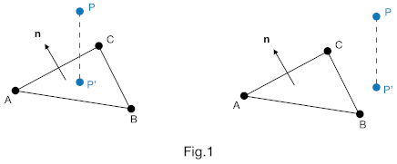
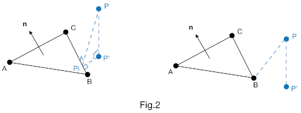
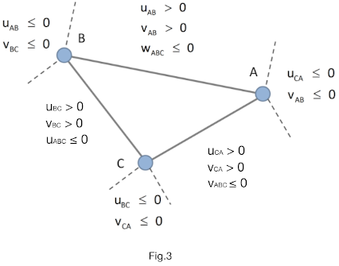

# Signed distance field (SDF) in 3D
[Fuhrmann,2003] introduces an efficient method to calculate the SDF of 3D objects.

In their paper, they state that the distance from a point to a triangle can be calculated using Voronoi regions, but they do not provide any details.
After a lot of searching, I found [this article](http://box2d.org/files/GDC2010/GDC2010_Catto_Erin_GJK.pdf) written by [Erin Catto](https://box2d.org/author/ecatto/) which explains exactly how to calculate that distance using Voronoi regions.

# Find the distance from a point to a triangle


For example, in Fig.1, we want to find the distance from `P` to `ΔABC`.
We first project `P` onto the plane of `ΔABC` to get `P'`.
By examining the barycentric coordinate of `P` with respect to `ΔABC`,
we can know whether `P'` is inside `ΔABC` or not.
If inside, then `dist = dot(n, AP) * theSignOf(dot(n, AP))`.

Otherwise, we must find the closest edge (Fig.2 left) or vertex (Fig.2 right) of `ΔABC` to `P`.



One way to achieve this is to use Voronoi regions.
Details of the algorithm can be found in Erin Catto's article.
Here, I only provide the summary (Fig.3).



Note that the `(u,v)` of a line segment and the `(u,v,w)` of a barycentric coordinate may be different due to the definition we use.
In that case, the conditional statements in Fig.3 may also be different.
So be careful with that.

# The barycentric coordinates system
The full article of calculating the barycentric coordinate of a point can be found [here](https://www.scratchapixel.com/lessons/3d-basic-rendering/ray-tracing-rendering-a-triangle/barycentric-coordinates).

For short, if a triangle is defined by vertices `ABC` in counter-clockwise,
and `P` is a point on the same plane with `ABC`,
then `P` can be described as `P = uA + vB + wC`.
Here, `(u, v, w)` is called the barycentric coordinate of `P` with respect to `ABC`.

`(u, v, w)` can be calculated using the ratio of triangle areas.

Let `Sabc`, `Sabp`, `Sbcp` and `Scap` be the area of triangle `ABC`, `ABP`, `BCP` and `ACP`, respectively.
Then `(u, v, w)` can be calculated as
```
u = Sbcp/Sabc
v = Scap/Sabc
w = Sabp/Sabc
```

## The signed area of a triangle
If a triangle is defined by vertices `ABC`,
then its area can be calculated as
`Sabc = 0.5 * length(cross(AB, AC))`.

Note that the magnitude of the cross product of `AB` and `AC` defines the area of a parallelogram,
and the area of a triangle is equal to half of that area, i.e.
```
Sparallelogram = |AB|*|AC|*sin(∠A) = length(cross(AB, AC))
Striangle = 0.5 * Sparallelogram
```

Be careful that the order of the vectors in cross product matters.
For example, when point `P` is outside the triangle,
the four areas will have different signs.
In this case, we must use something like
```
vec3 temp = cross(AB, AC);
float area = 0.5 * length(temp) * sign;
```
to calculate the signed area.

In 2D, we can use the z-component to decide `sign`, i.e.
```
float sign = (temp.z > 0) ? 1 : -1;
```
In 3D, However, things become a little different because `temp` can points to any direction.
As a result, we cannot decide `sign` only based on z-component.

Instead, we can use the surface normal `N` of `ΔABC`.
If `temp` points to the same direction as `N` does,
then we decide `sign = 1`.
Otherwise, `sign = -1`, i.e.
```
float sign = dot(normalize(temp), N);
```


# Reference
[Fuhrmann,2003] Fuhrmann, Arnulph, Gerrit Sobotka, and Clemens Groß. "Distance fields for rapid collision detection in physically based modeling." Proceedings of GraphiCon 2003. 2003.
